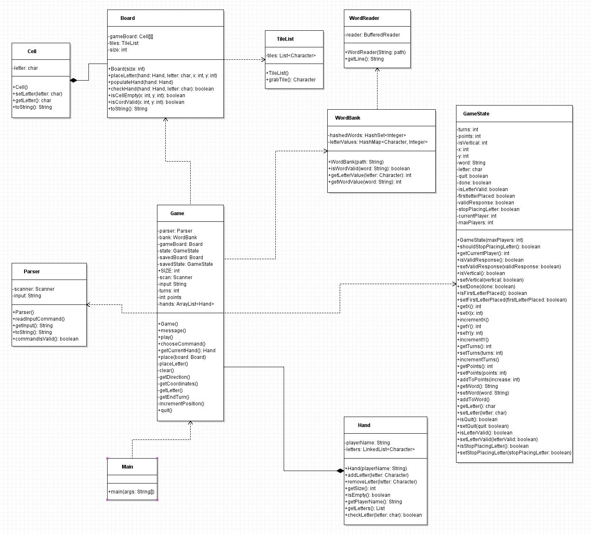

# Scrabble

A simple version of Scrabble written in Java. See the [glossary](#Glossary) for the list of terms used.

### Rules

In short, Scrabble is about placing neighbouring letters to make words. For each [turn](#Glossary), the player must choose one of three options. They can [pass](#Passing) the [turn](#Glossary), [exchange](#Exchanging) letters with the [bag](#Glossary), or [play](#Playing) [tiles](#Glossary) to make a word.

#### Passing

Passing allows the player to forfeit their [turn](#Glossary) and score no points. Passing is usually done when the [bag](#Glossary) has no more letters, and the player cannot make a valid word on the board with their current letters.

#### Exchanging

Exchanging allows the player to exchange one or more [tiles](#Glossary) with the [bag](#Glossary), for an equal number of [tiles](#Glossary). The player will not be able to score any points and forfeits their opportunity to play a word for that [turn](#Glossary). The player may not exchange if there are less than seven [tiles](#Glossary) remaining in the [bag](#Glossary). Exchanging is usually done when the player cannot make any valid words on the [board](#Glossary) with their current letters, or if the player is close to a high value word but is missing one or more letters.

#### Playing

Playing is how a player scores points and win. To score points, the player must make a word on the [board](#Glossary). To make a word, the player must place one to seven letters to make a word. The player may not place any letters if they do not contribute to making a word in the same [turn](#Glossary). For the first [turn](#Glossary) of the game, the player must play at least two letters to form a valid word. After, the player may place a single letter as long as it forms a valid word.

Once the player has played a valid word, they may retrieve the number of letters used from the [bag](#Glossary), such that they have seven letters. If the [bag](#Glossary) does not have enough letters such that the player cannot obtain seven letters on their [rack](#Glossary), they may empty the [bag](#Glossary) and take the remaining letters.
Create words out of the letters given to you in your hand. Words have different values depending on the number and type of letters in them.

### How To Play

Use the Text User Interface to type and respond to prompts generated and displayed on the window.

### Implementation

##### [Board](src/Board.java)

Provides a way for the [game](#Game) class to update and check specific cells within the board. Also, until a GUI is implemented, provides a way to get a string representation of the board, used periodically throughout the application.

##### [Cell](src/Cell.java)

Acts as a cell within the [board](#Glossary), where a cell can have a specific letter (and later, word modifiers). 

##### [Game](src/Game.java)

Acts as the core of the game, incorporating all the various classes created throughout the project. It holds the [hands](#Hand), [word bank](#WordBank), [parser](#Parser), [state](#State), and the [board](#Board). It provides a way to place letters, check if a newly placed word is valid, start and end turns, and more.

##### [GameState](src/GameState.java)

Provides a way of checking and setting the state of the game. Since the game is command line based, there are many steps involved in, for example, placing a letter. We need a way to preserve what the user previously inputted, allow us to check if the user placed a valid letter. The [game state](#GameState) class also provides other methods such as checking if the user has quit the game, advancing the xy coordinates for the current letter, and more.

##### [Hand](src/Hand.java)

Acts as the state for a player, where the player can have a name, and a set of letters. Is extensively used in the [game](#Game) and [board](#Board) for checking and updating the state of the players.

##### [Main](src/Main.java)

Creates an instance of the game and calls play, where all the logic is handled inside of the [game](#Game) class. Contains the main method, acting as the main entry point into the application.

##### [Parser](src/Parser.java)

Provides a facility for interpreting the command line input by the user. Essentially, the user can input commands such as place, pass, or quit, and we need to determine what the user said. The parser reads from stdin into a string, and checks if the string matches any of the available commands. We can also filter out bad user input here by looping until the user provides a valid command. This allows us to abstract out a large amount of the user input into a separate class.

##### [TileList](src/TileList.java)

Provides a facility similar to that of the [bag](#Glossary). It contains a data structure of all the available letters, so that we can later populate the player's [racks](#Glossary) with these letters. For the data structure, we decided to use a Java Collection, as it provides a method for shuffling the contents. We can use this to shuffle the letters to provide some randomness to the game.

##### [WordBank](src/WordBank.java)

Provides a facility for storing many words in memory and checking if words are valid, and the value of the words. Since we have to store many words and each word can consume a large amount of memory, it is not ideal to store the words as plain strings. Instead, we can hash all the words so that we can store the words as integers, and if we want to check if a word is valid, we can hash that word and check if the hash value exists. This greatly reduces the amount of memory used, allowing us to add many more words in the future. We store the hashes (integers) as a set, as there is already a hashing function for integers and a set offers fast lookup times. The value of a word depends on the values of the letters it contains. Therefore, to determine the value of the word, we can iterate over the word and take the sum of the values of the letters it contains. We can store the values of the letters using a basic hash map, where the letters map to integers representing the values of the letters.

##### [WordReader](src/WordReader.java)

Provides a facility for reading many words into a local buffer in memory. The lists of valid words that can be used are retrieved from a website using the Java URL library. We download the data from a specified URL, and extract the words from the data. If the user has no internet connection or the download failed, we also have a backup list of words stored in a local text file which can be extracted in the same manner. Currently, there are ten thousand valid words in the database, however, this can be increased by downloading the words from different website or creating a larger local database of words.

### Glossary

- Turn: Where a player gets the opportunity to pick between [passing](#Passing), [exchanging](#Exchanging), and [playing](#Playing).
- Bag: The remaining letters. Can be used to [exchange](#Exchange) letters with, or refill the [rack](#Glossary) after making a word.
- Rack: The one to seven letters that each player has the opportunity to make a word with.
- Tile: The physical representation of a letter. Consists of the letter, and the value of the letter.
- Board: The device for which players can place [tiles](#Glossary) on to make words.

#### UML Diagram 

### Known issues

- It is not possible for the player to create two words in a single turn
- Clearing the board does not work properly so words that are not valid stay on the board

### Roadmap
- Adding a GUI and testing in Milestone 2
- All tests need to pass and an AI player added in Milestone 3
- Added features like Undo/Redo, Save/Load, and custom boards in Milestone 4
