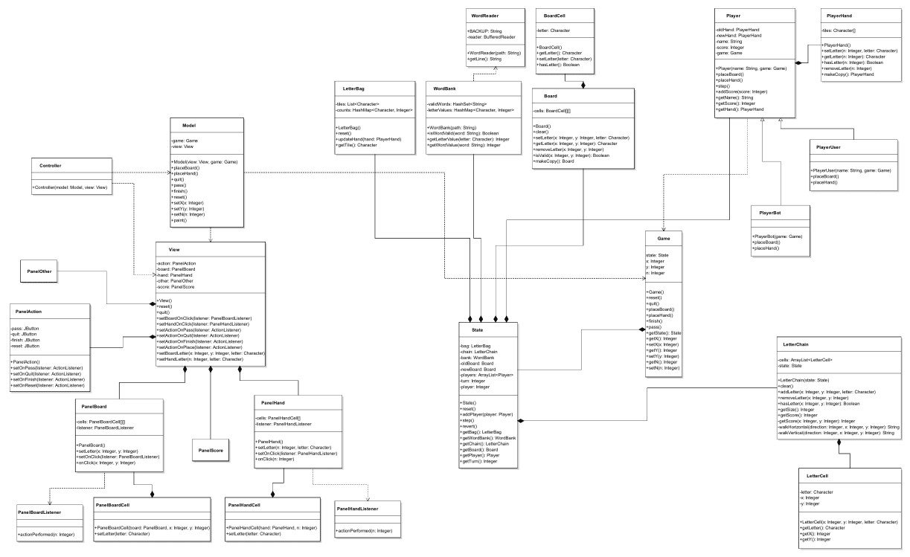

# Scrabble

A simple version of Scrabble written in Java. 

### Rules

In short, Scrabble is about placing neighbouring letters to make words. For each turn, the player must choose one of three options. They can pass the turn, exchange letters with the bag, or play tiles to make a word.

#### Passing

Passing allows the player to forfeit their turn and score no points. Passing is usually done when the bag has no more letters, and the player cannot make a valid word on the board with their current letters.

#### Exchanging

Exchanging allows the player to exchange one or more tiles with the bag, for an equal number of tiles. The player will not be able to score any points and forfeits their opportunity to play a word for that turn. The player may not exchange if there are less than seven tiles remaining in the bag. Exchanging is usually done when the player cannot make any valid words on the board with their current letters, or if the player is close to a high value word but is missing one or more letters.

#### Playing

Playing is how a player scores points and win. To score points, the player must make a word on the board. To make a word, the player must place one to seven letters to make a word. The player may not place any letters if they do not contribute to making a word in the same turn. For the first turn of the game, the player must play at least two letters to form a valid word. After, the player may place a single letter as long as it forms a valid word.

Once the player has played a valid word, they may retrieve the number of letters used from the bag, such that they have seven letters. If the bag does not have enough letters such that the player cannot obtain seven letters on their rack, they may empty the bag and take the remaining letters. Create words out of the letters given to you in your hand. Words have different values depending on the number and type of letters in them.

### How To Play

Start the application by executing the Jar file, or by using an IDE to build and execute the source code directly. When the application starts, you will be greeted by a start screen. To read about how to play the game, click the help button on the start screen, where you will be presented with detailed information about how to configure a game, what the various buttons are for, and more.

### Implementation

#### Structure

The basis of the design follows MVC, where we have a view that contains the window and GUI elements, the model that contains
the state of the program, and the controller that manipulates the model. In the view, there are many classes that implement various components of the GUI. These components include the start, setup, play, and help screen. Within each of these components, there are several smaller components. For example, the play screen contains a board component, and hand component, etc.

The two types of supported players are users and bots. Users are players that are controlled by a user, whereas bots are players that are controlled automatically in the code. Each player inherits from a generic player and overrides several methods that allow the player to make a move. This way, we can call a specific method and the correct implementation of the method will be called automatically.

#### Classes

##### [Board](src/Board.java)

Represents all of the cells on the board. By storing an old one and a new one, we can reset to the old one whenever the player wishes to undo, or makes an invalid set of moves. The board is integral to representing the current state of the game. To represent the board we decided to use a simple 2D array, so that we can look up specific elements using basic x and y coordinates. 

##### [BoardCell](src/BoardCell.java)

Represents a cell within the board. A cell consists of a letter, along with a few getter and setter methods for setting the letter. In addition to the letter, the cell also can contain a specific modifier, which can be used for increasing the value of the letter or word if the letter is placed in the cell.

##### [Config](src/Config.java)

Represents the configuration for the game. Provides several global variables for manipulating the style of the game, the values of the letters, the number of letters, the website to fetch the words from, and more. Eventually, this will provide an easy way to allow for the configuration of variables persisted in a file.

##### [Controller](src/Controller.java)

Represents the controller component of the MVC. Attaches itself to a view and model and sets callbacks for the view which notify
the model of any changes. The controller does not hold any state itself, but instead responds to events triggered by the view in the form of callbacks and manipulates the model.

##### [Game](src/Game.java)

Ties together multiple components of the application. Uses the board, the letter chain, the word bank, the players, and more to
provide an interface for placing, removing, passing, quitting, resetting, and more for the application. Currently, the game is owned by the model but eventually, this may be removed and the model will inherit all of its methods.

##### [LetterBag](src/LetterBag.java)

Represents the bag or the leftover letters for the game. Can be used to populate the player hands after placing a word. We decided to use a linked list to represent the letters, so that we can quickly pop off the head letter and since we would never have to iterate the letters.

##### [LetterCell](src/LetterCell.java)

Similar to a board cell, however, instead of just having a letter, it also has a position. This is used in the letter chain to represent where the letters are placed. Unlike the board cell, this does not possess any modifiers.

##### [LetterChain](src/LetterChain.java)

Represents the word that the player is attempting to create. Holds several letter cells, and on demand, will attempt to compute
the score acheived placing the word. To represent the letter, we decided to use an array list so that we can quickly iterate over the entire list as we would be doing this whenever we had to check if a turn was valid.

##### [Main](src/Main.java)

Initializes several components of the application, attaches them, and starts them.

##### [Model](src/Model.java)

Represents the model component of the MVC. Attaches itself to a view, and upon being notified by the controller, updates the view and the game. Holds the entire state of the program, providing a simple interface for manipulating the state with a single method call. Instructs the view about the current state of the board, the hand, the scoreboard, and more.

##### [Model](src/NameGen.java)

Loads various names from a file, shuffles the words using collections and a linked list, and provides a method for taking a name from the front. Once a name is taken, the same name is added back to the end of the linked list so that it may be recycled.

##### [PanelAction](src/PlayPanelAction.java)

Represents the action panel of the view. Provides several buttons for passing, quitting, resetting, and finishing along with
the associated callbacks. Allows for the registering of callbacks in the form of action listeners to specific buttons.

##### [PanelBoard](src/PlayPanelBoard.java)

Represents the board panel of the view. Contains many buttons/cells which can be used to specify which cell was clicked, and
provides a callback for when a specific cell is clicked. Since cells are implemented as buttons, they can instruct the class the coordinates of which cell was clicked, allowing for the information to be forwarded to the controller.

##### [PanelBoardCell](src/PlayPanelBoardCell.java)

Represents a button/cell within the board panel. Provides a method for setting the letter in the cell and notifies the board panel when it is pressed. Each cell inherits from a JButton, which automatically sets the action listener to instruct the board about the coordinates of the cell that was pressed.

##### [PanelBoardListener](src/PlayPanelBoardListener.java)

Similar to a common action listener, however it specializes the callback method with position parameters.

##### [PanelHand](src/PlayPanelHand.java)

Represents the hand panel of the view. Contains several buttons/cells which can be used to specify which cell was clicked, and
provides a callback for when a specific cell is clicked. Since cells are implemented as buttons, they can instruct the class the index of which cell was clicked, allowing for the information to be forward to the controller.

##### [PanelHandCell](src/PlayPanelHandCell.java)

Represents a button/cell within the hand panel. Provides a method for setting the letter in the cell and notifies the hand panel
when it is pressed. Each cell inherits from a Jbutton, which automatically sets the action listener to instruct the hand about the index of the cell that was pressed.

##### [PanelHandListener](src/PlayPanelHandListener.java)

Similar to a common action listener, however it specializes the callback method with an index parameter.

##### [PanelOther](src/PlayPanelOther.java)

Represents the other/misc panel of the view. Provides information such as the current turn, along with the current player within the current turn. Also provides methods for updating the current turn and the current player.

##### [PanelScore](src/PlayPanelScore.java)

Represents the score panel of the view. Displays each of the players in the game along with their respective scores. Provides a method for updating the score and the player name at a certain index in the scoreboard. The scores are all implemented as JLabels for simplicity.

##### [Player](src/Player.java)

Represents a player within the game. Both the user player and the bot player inherit from it to provide a polymorphic 
player type that can make moves. The player contains two hands being the previous hand and the current hand. This allows the game to reset the player back to the previous hand in the case of bad player input.

##### [PlayerBot](src/PlayerBot.java)

Represents a computer player in the game. Provides an automatic method for placing letters on the board to make a word. The words are generated and decided on by generating all of the possible words that can be placed on the board with the current hand, and then picking the word that would give the player the highest number of points.

##### [PlayerHand](src/PlayerHand.java)

Represents the tiles that the player holds. Provides methods for setting the letter at a specific index, removing it, and 
checking if it exists. To represent the tiles, we decided to use a basic 1D array, since we would have to iterate the array
often and wanted to get and set elements by their respective index.

##### [PlayerUser](src/PlayerUser.java)

Represents a user player in the game. Provides a method for placing a letter on the board and back to the hand.

##### [State](src/State.java)

Represents the internal state of the game. Consists of various components such as the word bank, the letter bag, the players,
the new board, the old board, the current turn, the current player, and more. To allow for saving and loading, this is all that
needs to be saved and loaded.

##### [View](src/View.java)

Represents the view component of the MVC. Contains all the previously listed panels and provides a wrapper to forward calls
into the panels. Also creates and manages the frame. The view can be in several states such as the start screen, the play screen, the setup screen, and the help screen.

##### [WordBank](src/WordBank.java)

Represents the word database. Has methods for checking if a word is valid, getting the value of a letter, and computing the value of a word. Uses the word reader to acquire the valid words. To store the words, we decided to use a hash set. This way, we can hash the string and quickly check if they are valid instead of having to iterate over the entire list of words.

##### [WordReader](src/WordReader.java)

Reads from either or website or as a fallback, a local file to acquire a buffer of all the words.

#### UML Diagram 

